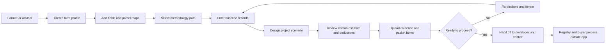
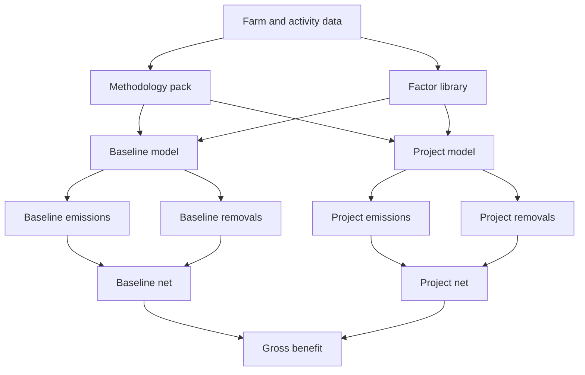
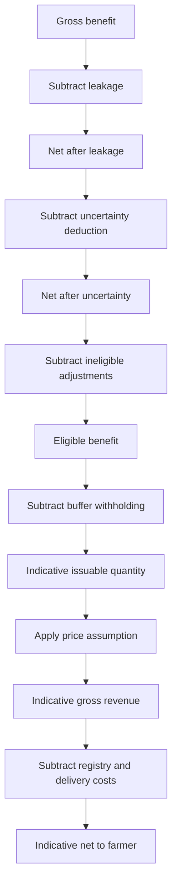

# Farm Carbon Readiness Platform

Presentation-style project document

---

## 1. Project In One Line

This project is a farmer-facing carbon readiness and pre-feasibility platform that helps estimate whether a farm can become a credible carbon project, what carbon benefit might be generated, what deductions reduce that benefit, and what evidence is still required before any credits could realistically be verified and sold.

---

## 2. Why This Product Exists

Most simple carbon tools fail in one of two ways:

- they are too shallow and only show a single credit number
- they overclaim and act as if modeled results are already certified credits

Real agricultural carbon projects are much more complex.

Before a farmer can sell carbon credits, the project usually needs:

- methodology fit
- parcel eligibility
- baseline history
- additionality
- quantification logic
- deductions and conservative adjustments
- MRV evidence
- validation, verification, and registry issuance

This product exists to make that hidden process visible.

---

## 3. Core Goal

The goal is not to act as a registry or directly mint credits.

The goal is to answer five practical questions:

1. Is this farm or parcel eligible for a credible carbon project path?
2. What is the baseline emissions and removals profile?
3. What climate benefit could the project scenario create?
4. What deductions and exclusions reduce that quantity before any issuance claim?
5. What records, parcel evidence, and readiness work are still missing?

So the platform is best understood as a carbon project operating workbench for early-stage project screening.

---

## 4. What The App Does

The app currently aims to do the following:

- collect farm, field, and parcel data
- screen methodology fit and project eligibility
- model baseline versus project outcomes
- apply deduction logic such as leakage, uncertainty, buffer, and ineligible area
- track parcel mapping quality and exclusions
- track readiness and evidence gaps
- show an indicative commercial scenario

The app is designed to show the whole chain, not just the final number.

---

## 5. What The App Does Not Do

This app does not, by itself:

- certify a farm
- issue registry credits
- replace validation or verification
- guarantee a buyer or sale price
- guarantee that modeled benefit becomes saleable credits

This distinction matters because in the real market, verified credits are usually sold only after registry and verification processes are complete.

---

## 6. Primary Users

Primary users:

- farmers
- farm managers
- agricultural advisors
- project origination teams

Secondary users:

- carbon project developers
- MRV operations teams
- sustainability leads
- verifier-facing coordinators

The product is farmer-facing in experience, but serious enough to be useful for advisors and project developers.

---

## 7. Product Positioning

This project is closer to a carbon readiness operating system than a generic calculator.

It combines:

- intake workflow
- eligibility screener
- quantification workbench
- MRV evidence tracker
- readiness score and gate view
- commercial pre-feasibility screen

That is a more realistic product position than calling it a marketplace or exchange.

---

## 8. End-To-End Logic Flow

The product follows the actual project-development sequence.

### Stage 1: Eligibility And Scoping

Checks whether the farm, geography, parcel, and intended project type fit a methodology path.

Typical checks:

- region fit
- land-use fit
- land control
- project timing
- baseline history
- double counting risk

### Stage 2: Baseline Definition

Establishes the pre-project operating pattern.

Typical inputs:

- crop history
- fertilizer intensity
- diesel use
- electricity use
- livestock counts
- baseline removals

### Stage 3: Scenario Design

Defines the proposed change.

Examples:

- no-till
- reduced tillage
- cover crops
- nutrient optimization
- grazing improvements
- agroforestry adoption

### Stage 4: Quantification

Models baseline and project balances, then derives gross climate benefit.

### Stage 5: Deductions And Eligibility Adjustments

Reduces the modeled benefit through:

- leakage
- uncertainty
- ineligible activities or area
- buffer or permanence reserve

### Stage 6: MRV Readiness

Tracks whether parcel boundaries, records, sampling, and supporting evidence are strong enough.

### Stage 7: Commercial Screening

Shows an indicative quantity and rough economics after deductions and costs.

### User Journey Diagram

---

## 9. Current Product Modules

The current product direction is built around these modules:

1. Farm setup
2. Field records
3. Mapping and parcel review
4. Scenario tuning
5. Eligibility and additionality checks
6. Readiness and evidence view
7. Results and deductions waterfall
8. Packet or audit summary

This gives the app a real workflow structure instead of a static landing-page feel.

---

## 10. Core Quantification Reasoning

The project uses one important principle:

Modeled benefit is not the same thing as issued credits.

That means the platform must separate:

- gross climate improvement
- conservative deductions
- ineligible or excluded quantity
- indicative issuable quantity
- indicative commercial outcome

This is the main reasoning behind the waterfall logic.

Instead of pretending that all climate benefit becomes sellable credits, the app shows how and why the number gets reduced.

---

## 11. Formula Stack

The formulas below are framework-level formulas. In a serious production product, they should always be parameterized by methodology pack and factor source.

### 11.1 CO2e Conversion

$$
CO2e = CO2 + (CH4 \times GWP_{CH4}) + (N2O \times GWP_{N2O})
$$

Purpose:
Convert different greenhouse gases into a common climate unit.

### 11.2 Generic Activity Emissions

$$
Emissions_i = Activity_i \times EF_i
$$

Purpose:
Translate measured farm activity into emissions using approved factors.

### 11.3 Diesel Emissions

$$
Diesel\ Emissions = Diesel\ Liters \times EF_{diesel}
$$

Purpose:
Estimate combustion emissions from machinery or field operations.

### 11.4 Electricity Emissions

$$
Electricity\ Emissions = Electricity\ kWh \times EF_{grid}
$$

Purpose:
Capture irrigation or other electricity-related emissions.

### 11.5 Direct Soil N2O From Nitrogen

$$
N2O\text{-}N_{direct} = N_{applied} \times EF_1
$$

$$
N2O_{direct} = N2O\text{-}N_{direct} \times \frac{44}{28}
$$

$$
Emissions_{direct\ N2O} = N2O_{direct} \times GWP_{N2O}
$$

Purpose:
Estimate nitrous oxide from nitrogen input intensity, which is often a major agricultural emissions source.

### 11.6 Enteric Methane

$$
CH4_{enteric} = \sum (Animals_c \times EF_{enteric,c})
$$

$$
Emissions_{enteric} = CH4_{enteric} \times GWP_{CH4}
$$

Purpose:
Estimate livestock methane where the farm system includes animals.

### 11.7 Manure Emissions

$$
Emissions_{manure} = \sum (Animals_c \times EF_{manure,c,system})
$$

Purpose:
Capture manure-system emissions when relevant.

### 11.8 Soil Organic Carbon Change

$$
Annual\ SOC\ Change = \frac{(SOC_{t2} - SOC_{t1}) \times BD \times Depth \times Area \times (1 - CF) \times \frac{44}{12}}{Monitoring\ Interval}
$$

Purpose:
Represent stock-change logic for soil carbon where methodology and sampling support it.

### 11.9 Baseline Net Balance

$$
Baseline\ Net = Baseline\ Emissions - Baseline\ Removals
$$

Purpose:
Describe the farm's climate balance before the project.

### 11.10 Project Net Balance

$$
Project\ Net = Project\ Emissions - Project\ Removals
$$

Purpose:
Describe the expected climate balance after project practices are applied.

### 11.11 Gross Quantified Benefit

$$
Gross\ Benefit = Baseline\ Net - Project\ Net
$$

Purpose:
Measure the climate improvement created by the project before conservative adjustments.

### 11.12 Deduction Logic

Framework deduction flow:

$$
Net\ After\ Leakage = Gross\ Benefit - Leakage
$$

$$
Net\ After\ Uncertainty = Net\ After\ Leakage - Uncertainty\ Deduction
$$

$$
Eligible\ Benefit = Net\ After\ Uncertainty - Ineligible\ Adjustments
$$

$$
Indicative\ Issuable\ Quantity = \max(0, Eligible\ Benefit - Buffer\ Withholding)
$$

Purpose:
Reduce modeled climate benefit into a more realistic indicative quantity.

### 11.13 Commercial Waterfall

$$
Indicative\ Gross\ Revenue = Indicative\ Issuable\ Quantity \times Price\ Assumption
$$

$$
Indicative\ Net\ To\ Farmer = Gross\ Revenue - Registry\ Costs - Validation\ Costs - Verification\ Costs - Developer\ Share - Platform\ Fee - Financing\ Discount - Taxes
$$

Purpose:
Show whether the project still makes sense financially after real-world cost layers.

### 11.14 Carbon Logic Diagram

---

## 12. Why The Deduction Waterfall Matters

Most unrealistic carbon tools effectively do this:

$$
Credits = Gross\ Benefit
$$

That is almost always too optimistic.

This product instead uses a waterfall because real projects lose quantity through:

- leakage
- uncertainty
- ineligible land or activity
- permanence reserve or buffer
- commercial and operational costs

This reasoning is one of the most important credibility features of the product.

### Deductions Waterfall Diagram

---

## 13. Parcel And Mapping Reasoning

Spatial logic matters because project eligibility is not only about the whole farm.

A farm can be partly eligible and partly excluded.

That is why the product tracks:

- parcel boundary status
- geometry confidence
- sampling coverage
- adjacency risk
- excluded area
- exclusion reason

This is important because in the real world, roads, structures, riparian buffers, drainage edges, or weakly verified boundaries can reduce the truly creditable area.

The platform should therefore distinguish between:

- total farm area
- mapped area
- eligible area
- excluded area

---

## 14. Eligibility And Additionality Reasoning

Another core principle is that carbon benefit alone is not enough.

A farm can show modeled climate improvement and still fail the project screen.

The platform therefore checks gates such as:

- land control
- methodology fit
- baseline history
- double counting risk
- regulatory surplus
- common practice
- barrier logic
- adoption timing

Reasoning:

If a practice is already mandatory, already common, or not properly controlled by the participant, the project may not qualify even if the math looks attractive.

---

## 15. MRV And Evidence Logic

The product does not stop at calculations because a real project must survive review.

That is why the system also tracks:

- parcel maps
- baseline records
- fuel and input records
- soil tests and sampling plans
- invoices and receipts
- reviewer notes
- packet readiness

The logic here is simple:

No evidence means no credible verification path.

So the product combines numeric estimates with a readiness view instead of presenting numbers in isolation.

---

## 16. Commercial Logic

The commercial section exists for farmer decision-making, but it is intentionally marked as indicative.

It helps answer:

- if this project works technically, does it still make sense financially?
- after deductions and costs, is there enough value left for the farmer?

The reasoning is that many projects look good on gross carbon quantity, but become weak after:

- buffer withholding
- verification costs
- registry costs
- developer share
- financing discount

That is why the commercial view is a screening layer, not a promise.

---

## 17. Current MVP Scope

The serious MVP direction for this project is:

1. methodology-aware intake
2. parcel and field setup
3. baseline versus scenario workbench
4. deductions waterfall
5. MRV evidence desk
6. readiness gates and score
7. indicative commercial output
8. report summary

This is enough to demonstrate a credible product direction without falsely claiming full issuance-grade functionality.

---

## 18. Product Credibility Rules

The app should always communicate carefully.

Avoid language like:

- guaranteed credits
- certified project
- approved payout

Prefer language like:

- indicative estimate
- methodology-aligned estimate
- subject to validation, verification, and registry rules
- evidence still required

These wording rules are important because realism is part of the product quality.

---

## 19. Technical Architecture Direction

Recommended structure:

- Next.js frontend for the workbench experience
- backend API for structured farm, parcel, and evidence data
- factor and methodology services for transparent calculations
- separate quantification engine for reproducible runs
- evidence storage and export pipeline for packet generation

The long-term architecture should keep the calculation engine separate from the visual UI.

---

## 20. Final Project Statement

This project is a mock but serious agricultural carbon readiness platform that estimates baseline and project outcomes, applies real-world-style deductions, surfaces eligibility and evidence blockers, and shows what would still be needed before carbon credits could be credibly verified and sold.

---

## 21. Short Pitch Version

Farm Carbon Readiness Platform helps farmers and project teams understand whether land can qualify for a carbon project, how much indicative carbon benefit may be generated, what deductions reduce that quantity, and what evidence is required before any credits can realistically reach the market.

later:
If you want, I can make the diagrams more presentation-like with subgraphs and color-friendly structure.
I can also add one more diagram for the external market chain: farmer -> developer -> verifier -> registry -> buyer.